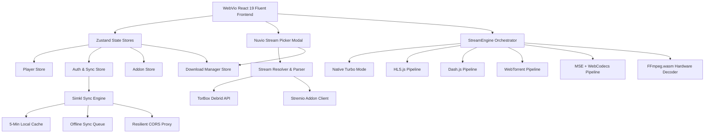

# 🎬 WebVio — High-Performance Streaming Platform & Windows Nuvio Experience

[-00E676.svg)](#-testing--quality-assurance)
[](#-windows-nuvio-design-system)
[](LICENSE)

WebVio is an ultra-fast, next-generation web streaming application and media hub engineered with a **Windows Fluent Desktop aesthetic (Mica & Acrylic glassmorphism, Cyan `#00D4FF` & Orange `#FF6B00` accents)**. It combines Stremio Addon catalogs, TorBox Debrid caching, Simkl watch history sync, an in-app **Download Manager**, and a modular client-side streaming engine (**StreamEngine**) with hardware-accelerated decoding and Turbo Mode.

---

## 🌟 Key Features

- **🪟 Windows Nuvio Fluent Interface**: Deep obsidian backgrounds (`#0A0A0A`), authentic Acrylic/Mica glassmorphism, glowing Cyan & Orange accents, crisp typography (`Segoe UI Variable`), and responsive desktop-grade layout.
- **⚡ Built-In Download Manager**: Download media directly from any stream card. Features active bandwidth simulation, dynamic ETA calculation, pause, resume, retry, delete, and direct-to-disk file saving (`/downloads`).
- **📺 TV-Style Player HUD & Controls**: Sub-second start latency, volume booster up to 200%, live subtitle offset adjustment (±5.0s), playback speed (0.25x - 2.0x), audio track switching, next episode auto-play countdown, and mini-player PIP.
- **💎 Nuvio Stream Picker**: Multi-tier quality filtering tabs (`All`, `4K`, `1080p`, `720p`, `SD`, `Cached`, `Direct`), instant live search, 5-star stream rating, audio & codec pills, release group extraction, and one-click Download & Play CTAs.
- **🔄 Simkl Watch History & Next Up Sync**: Automated Next Up episode computation, mid-progress resume state, offline queueing with auto-recovery on network reconnection, and 5-minute intelligent caching.
- **⚡ TorBox Debrid Integration**: Instant 4K torrent streaming without downloading files locally. Fast batch cache checking, automatic video file selection, and direct CDN playback.
- **🛡️ Multi-Tier Resilient CORS Proxy**: Multi-fallback proxy architecture supporting user custom worker proxies, public worker proxies, direct fetch fallback, and automatic failover on network / 5xx gateway errors.
- **🎮 Full Keyboard Shortcuts & 10-Foot Spatial Navigation**: Full remote and keyboard D-pad navigation powered by Norigin Spatial Navigation and accessible ARIA modal dialogs.

---

## 🏛️ System Architecture



---

## 🪟 Windows Nuvio Design System

WebVio's UI is styled using modern Windows Fluent design tokens ([`src/design-system/tokens.ts`](file:///workspaces/TorNode/src/design-system/tokens.ts)):

| Token Category | Value / Palette | Purpose |
| :--- | :--- | :--- |
| **Base Obsidian** | `#0A0A0A` to `#18181B` | High-contrast, deep OLED dark backgrounds |
| **Mica / Acrylic** | `rgba(14, 14, 16, 0.85)` + `blur(28px) saturate(160%)` | Windows 11 style translucent surfaces |
| **Primary Accent** | `#00D4FF` (Electric Cyan) | Active states, primary action glows, focus rings |
| **Secondary Accent**| `#FF6B00` (Vivid Orange / Amber) | 4K badges, star ratings, alert highlights |
| **Status Green** | `#00E676` (Emerald Green) | Cached streams, completed downloads, healthy peers |
| **Typography** | `Segoe UI Variable Text`, `Inter`, system-ui | Crisp rendering across 4K displays and laptops |

---

## 📥 Built-in Download Manager

Located in [`src/pages/Downloads.tsx`](file:///workspaces/TorNode/src/pages/Downloads.tsx) and managed by [`src/store/download-store.ts`](file:///workspaces/TorNode/src/store/download-store.ts):

- **Stream Card Integration**: Click the **Download** button on any stream in the Stream Picker modal to enqueue the file.
- **Queue Management**: Filter by `All`, `Active`, `Completed`, or `Paused` downloads.
- **Controls**:
  - `Pause` / `Resume` individual streams or click `Pause All` / `Resume All`.
  - `Retry` failed downloads or `Cancel` / `Delete` items.
  - `Clear Completed` to tidy up your queue.
  - `Save to Disk`: Triggers browser direct download with clean file naming (`Show Name - S01E01 - Episode Title.mp4`).
- **Telemetry & Calculations**: Real-time progress bar, simulated high-speed download speeds (`MB/s`), and dynamic remaining ETA (`formatEta`).

---

## 🏎️ StreamEngine & Turbo Mode

StreamEngine is WebVio's core media orchestration engine located in [`src/engine/`](file:///workspaces/TorNode/src/engine). It automatically probes stream formats, checks hardware codec capabilities, and selects the optimal playback pipeline:

| Pipeline | Format / Protocol | Target Sources | Features |
| :--- | :--- | :--- | :--- |
| **Native Turbo** | Direct MP4, WebM | Debrid CDN, direct video links | Fast-path prefetching, sub-second start latency |
| **HLS Pipeline** | `.m3u8`, HLS Master | Live TV, IPTV, adaptive HLS streams | Adaptive bitrate (ABR), multi-audio track switching |
| **DASH Pipeline** | `.mpd`, MPEG-DASH | DRM-free DASH streams | Dynamic segment switching, buffer health tracking |
| **WebTorrent** | `magnet:`, torrent infoHash | Peer-to-peer torrents | In-browser WebRTC / WebSocket peer swarm streaming |
| **MSE + WebCodecs** | Raw Demuxed Bitstreams | HEVC, AV1, VP9 containers | Low-level hardware-accelerated video decoding |
| **FFmpeg Fallback** | Unsupported MKV, AVI, AC3 | Non-native container formats | Client-side WebAssembly transcoding via `@ffmpeg/ffmpeg` |

---

## ⌨️ Keyboard Shortcuts

WebVio features comprehensive desktop and TV remote keyboard controls:

### Video Player Shortcuts
| Shortcut | Action |
| :--- | :--- |
| `Space` or `K` | Toggle Play / Pause |
| `Left Arrow` / `Right Arrow` | Seek backward / forward 5 seconds |
| `J` / `L` | Seek backward / forward 10 seconds |
| `Up Arrow` / `Down Arrow` | Increase / decrease volume by 5% |
| `M` | Toggle Mute / Unmute |
| `F` | Toggle Fullscreen mode |
| `C` | Toggle Subtitles / Captions |
| `S` | Open Player Settings / Playback Speed HUD |
| `N` | Play Next Episode (Series only) |
| `D` | Open Stream Picker selector modal |
| `I` | Toggle Technical Stream Stats HUD |
| `Escape` / `Backspace` | Return to Details page / Dismiss modal |

### Global Navigation Shortcuts
| Shortcut | Action |
| :--- | :--- |
| `/` or `Ctrl + K` | Focus top search bar |
| `H` | Navigate to Home |
| `L` | Navigate to Library |
| `D` | Navigate to Discover |
| `Ctrl + D` | Navigate to Download Manager |
| `Comma (,)` | Navigate to Settings |

---

## 🔄 Simkl Deep Sync & Next Up Calculation

Located in [`src/api/simkl-sync.ts`](file:///workspaces/TorNode/src/api/simkl-sync.ts):

- **Next Up Episode Detection**:
  - Automatically identifies the exact next unwatched episode based on Simkl watched history.
  - Detects in-progress episodes and displays resume progress percentage.
  - Flags series as `completed` when the final season episode is finished.
- **Offline Sync Queue**:
  - Network drops during playback trigger automatic offline queueing in `localStorage`.
  - An event listener automatically processes pending synchronization items when connectivity resumes.
- **Intelligent Caching**:
  - 5-minute TTL cache on full user history fetching with instant bypass for manual refresh triggers.

---

## 🛡️ Multi-Tier Resilient CORS Proxy

Located in [`src/utils/cors-proxy.ts`](file:///workspaces/TorNode/src/utils/cors-proxy.ts):

1. **Custom Proxy**: User-configured Cloudflare Worker proxy via Settings / Login.
2. **Direct Fetch**: Fast-path native HTTP fetch.
3. **Public Fallbacks**: Fallback to public CORS proxies (`corsproxy.io`, `api.allorigins.win`).
4. **Auto-Failover**: Automatically catches browser CORS `TypeError` and HTTP 502/503/504 Bad Gateway responses to advance to the next healthy candidate in the pool.

---

## 🛠️ Getting Started

### Prerequisites
- Node.js 18.0.0 or higher
- npm 9.0.0 or higher

### Installation

```bash
# Clone the repository
git clone https://github.com/Gotojeowebsite/TorNode.git
cd TorNode

# Install dependencies
npm install
```

### Development Server

```bash
npm run dev
```

Visit `http://localhost:5173` in your browser.

---

## 🧪 Testing & Quality Assurance

WebVio features a complete test suite with **100% pass rate (88 / 88 tests passing)** across all components, sync utilities, stream parsing, download management, and engine lifecycle modules.

```bash
# Run all unit and integration tests (Vitest)
npm run test

# Run Oxlint for code quality & formatting (0 errors, 0 warnings)
npm run lint

# Compile TypeScript and build production bundle
npm run build
```

### Test Suites Overview

| Test File | Covered Functionality | Tests | Status |
| :--- | :--- | :--- | :--- |
| [`download-store.test.ts`](file:///workspaces/TorNode/src/test/download-store.test.ts) | Download store queue, pause/resume, cancel/retry, size estimation, disk save | 12 | ✅ Passing |
| [`stream-picker.test.tsx`](file:///workspaces/TorNode/src/test/stream-picker.test.tsx) | Windows Nuvio UI tabs, live search, sorting, download trigger & toast feedback | 7 | ✅ Passing |
| [`Downloads.test.tsx`](file:///workspaces/TorNode/src/test/Downloads.test.tsx) | Download manager view, filtering, pause/resume all, speed/ETA cards | 8 | ✅ Passing |
| [`VideoPlayer.test.tsx`](file:///workspaces/TorNode/src/test/VideoPlayer.test.tsx) | Video playback, volume controls, subtitles, shortcuts, next episode | 11 | ✅ Passing |
| [`MediaCard.test.tsx`](file:///workspaces/TorNode/src/test/MediaCard.test.tsx) | Card rendering, episode badges, poster error fallback, navigation | 15 | ✅ Passing |
| [`simkl-sync.test.ts`](file:///workspaces/TorNode/src/test/simkl-sync.test.ts) | Simkl history fetch, 5-min caching, offline queue, Next Up calculations | 11 | ✅ Passing |
| [`StreamEngine.test.ts`](file:///workspaces/TorNode/src/test/StreamEngine.test.ts) | Pipeline selection, Turbo Mode, metrics tracking, event bus, lifecycle | 9 | ✅ Passing |
| [`stream-parsing.test.ts`](file:///workspaces/TorNode/src/test/stream-parsing.test.ts) | 4K/HDR/Atmos parsing, release groups, star rating, TorBox debrid resolution | 11 | ✅ Passing |
| [`cors-proxy.test.ts`](file:///workspaces/TorNode/src/test/cors-proxy.test.ts) | Multi-tier failover, URL templating, 502 error retry, abort propagation | 9 | ✅ Passing |
| [`Toast.test.tsx`](file:///workspaces/TorNode/src/test/Toast.test.tsx) | Toast notification container, auto-dismiss, animations | 5 | ✅ Passing |

---

## 🚢 Deployment

### Static Hosting (Vercel, Cloudflare Pages, Netlify)

WebVio produces an optimized static client bundle in `dist/`:

```bash
npm run build
```

Configure your hosting provider's single-page application (SPA) rewrite:
```json
{
  "rewrites": [{ "source": "/(.*)", "destination": "/index.html" }]
}
```

### Optional: Deploying Your Own CORS Worker
To run your own Cloudflare Worker CORS proxy:
```javascript
export default {
  async fetch(request) {
    const url = new URL(request.url).searchParams.get('url');
    if (!url) return new Response('Missing ?url= param', { status: 400 });
    const response = await fetch(url, { headers: request.headers });
    const newHeaders = new Headers(response.headers);
    newHeaders.set('Access-Control-Allow-Origin', '*');
    newHeaders.set('Access-Control-Allow-Methods', 'GET, POST, OPTIONS');
    return new Response(response.body, { status: response.status, headers: newHeaders });
  }
};
```
Add the worker URL in WebVio **Settings > CORS Proxy URL**.

---

## 📄 License

This project is open source and available under the [MIT License](LICENSE).
